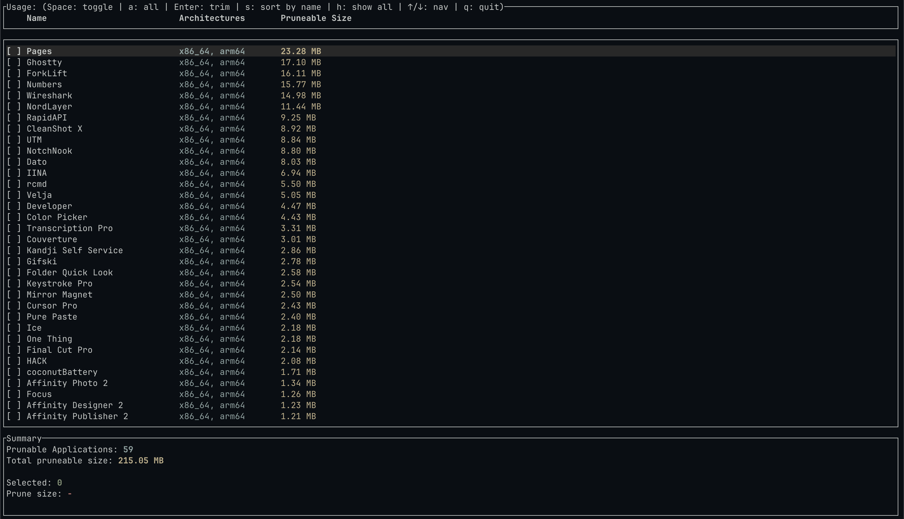

  <a align="center" href="https://vercel.com">
    
    <h3 align="center">bintrim</h3>
  </a>

A CLI utility for stripping legacy `x86_64` architecture from macOS universal binaries

 
 

## License

MIT

